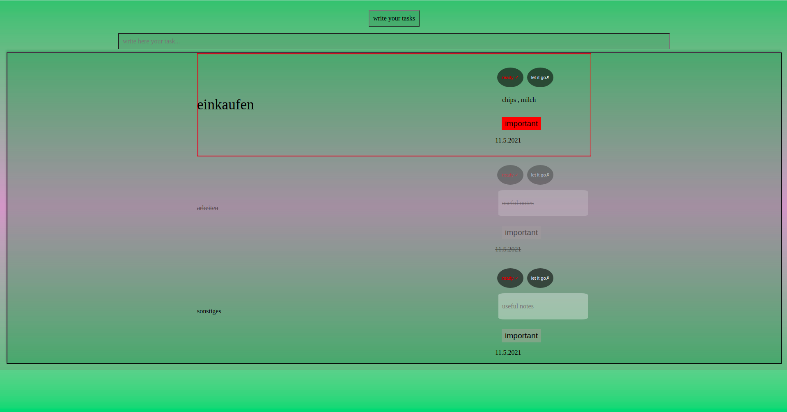

# TheRealToDoList
i made a simple to do list application using js DOM manipulators 
document.createElement
.appendChild
.classList.toggle
.addEventListener 
and also a version of code using bubble effect

